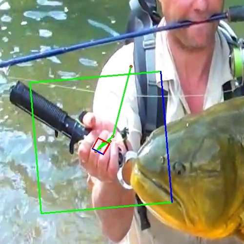
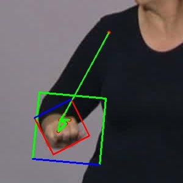
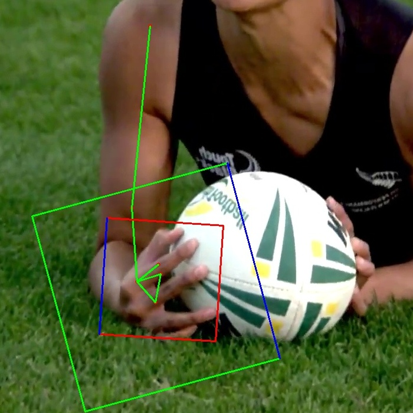
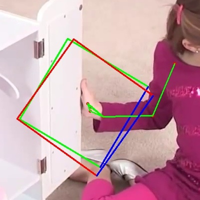
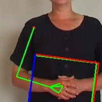

# MediaPipe Hand Crop Fix

Code for "Optimizing Hand Region Detection in MediaPipe Holistic Full-Body Pose Estimation to Improve Accuracy and Avoid
Downstream Errors".

Fixing https://github.com/google/mediapipe/issues/5373

## Motivation

The MediaPipe ROI estimation can be not so great... Here are a few examples:

Worst and Best are the edge cases as seen in the data. The rest were picked manually.
We only look at the right hand. If the data is for the left hand, we flip the image.
In the following table, for each image we show the hand keypoints in green lines, 
and two bounding boxes in green - gold ROI and red - predicted ROI.
To indicate the orientation of the bounding box, we draw a blue line on the bottom edge of each box.

| Worst                              | Bad                            | OK                           | Good                             | Best                             |
|------------------------------------|--------------------------------|------------------------------|----------------------------------|----------------------------------|
| ROI: 0.08%                         | ---                            | ---                          | ---                              | ROI: 93.7%                       |
|  |  |  |  |  |

## Usage

```bash
git clone https://github.com/sign-language-processing/mediapipe-hand-crop-fix.git
cd mediapipe-hand-crop-fix
```

Download and extract the Panoptic Hand Pose Dataset:

```bash
cd data
wget http://domedb.perception.cs.cmu.edu/panopticDB/hands/hand_labels.zip
```

Estimate full body poses using MediaPipe Holistic:

```bash
python -m mediapipe_crop_estimate.estimate_poses
```

Collect the annotations as well as estimated regions of interest:
```bash
python -m mediapipe_crop_estimate.collect_hands
```

Then, train an MLP using the annotations and estimated regions of interest:
```bash
python -m mediapipe_crop_estimate.train_mlp
```

Finally, evaluate:
```bash
python -m mediapipe_crop_estimate.evaluate
```